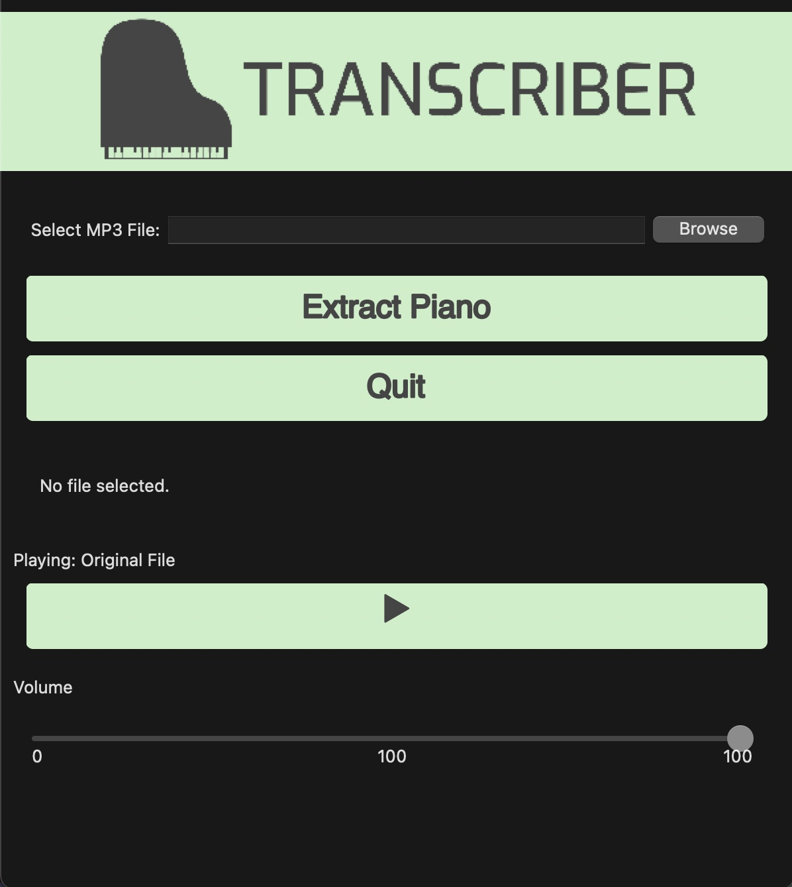

# Transcriber

Transcriber is a tool that isolates the piano track from a given audio file, converts it into a MIDI representation, and generates sheet music in PDF format.


## Features

- **MP3 Input**: Users can input an MP3 file to extract the piano track.
- **Piano Track Isolation**: Using Spleeter, we isolate the piano track from the audio.
- **MIDI Conversion**: The extracted piano track is then converted into a MIDI file.
- **Sheet Music Generation**: Produce a PDF with the sheet music representation of the MIDI.




## Requirements

- **Python Version**: 3.9
- **Libraries**:
  - `wxPython`
  - `spleeter`
  - `pygame`
  - `music21`
  - `basic_pitch`
  
## Installation

1. Clone this repository:
```
git clone https://github.com/your_username/piano-extractor.git
```
2. Navigate to the project directory:
```
cd Transcriber
```
3. Install the required packages:
```
pip3.9 install -r requirements.txt
```

4. Run the application:
```
python3.9 script.py
```

## Usage

1. **Select MP3 File**: Click on the file selection button and choose your desired MP3 file.
2. **Extract Piano**: Click the "Extract Piano" button. This will process the audio and extract the piano track, followed by MIDI and sheet music generation.
3. **Play Track**: Use the play/pause button to listen to the original track, extracted piano track, or the MIDI representation. Right-clicking the play/pause button toggles between the tracks.
4. **Exit**: Click the "Quit" button to exit the application.

> **Note**: Previous extraction results will be deleted when starting a new extraction.
> **Note**: Extraction Results will be found in their corresponding folder, isolated piano in OutputPiano, midi in OutputMIDI, etc.

## Contributing

Feel free to fork the repository, make changes, and open a pull request. All contributions are welcome!


